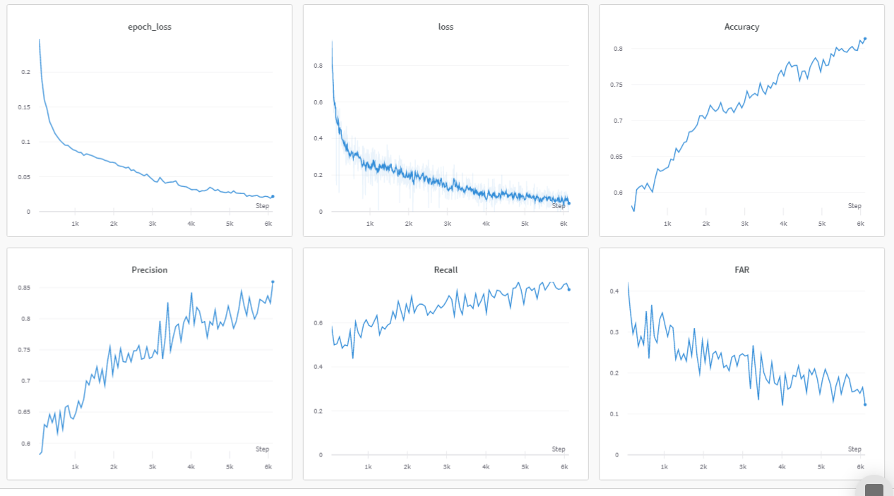
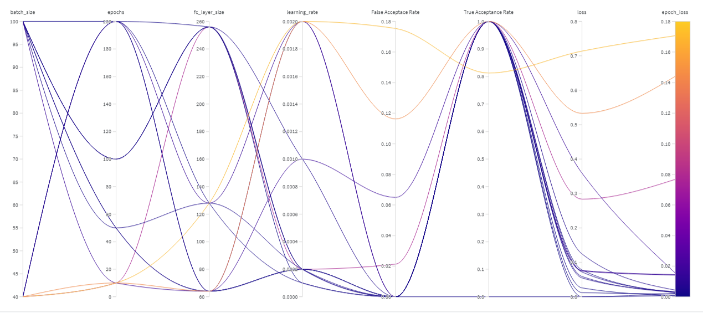
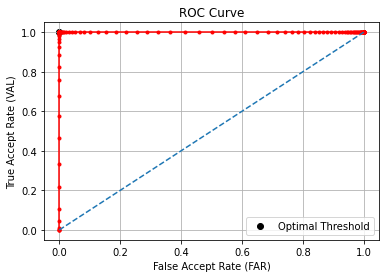
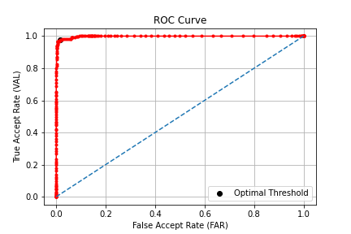
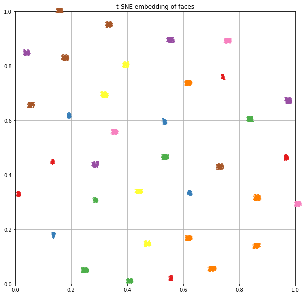
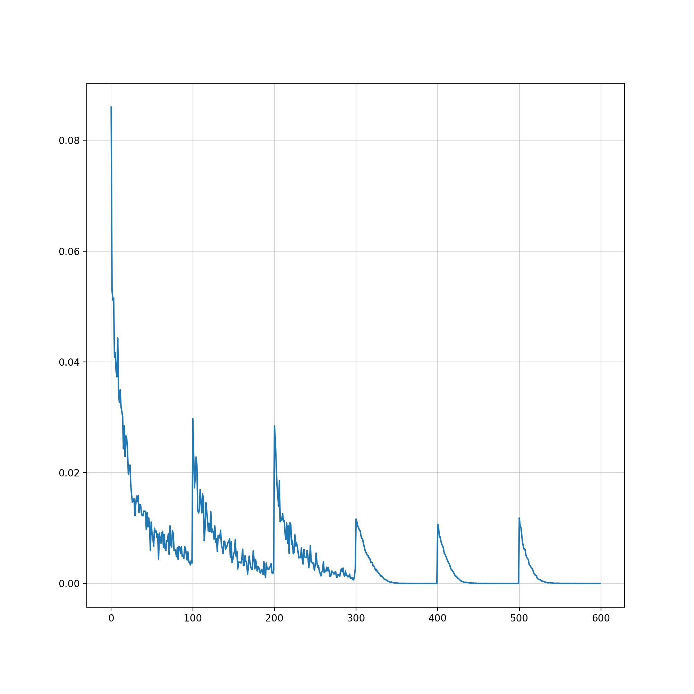
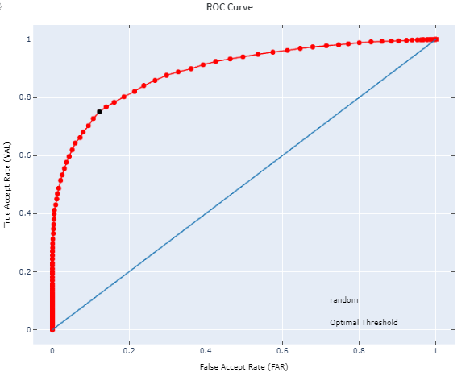
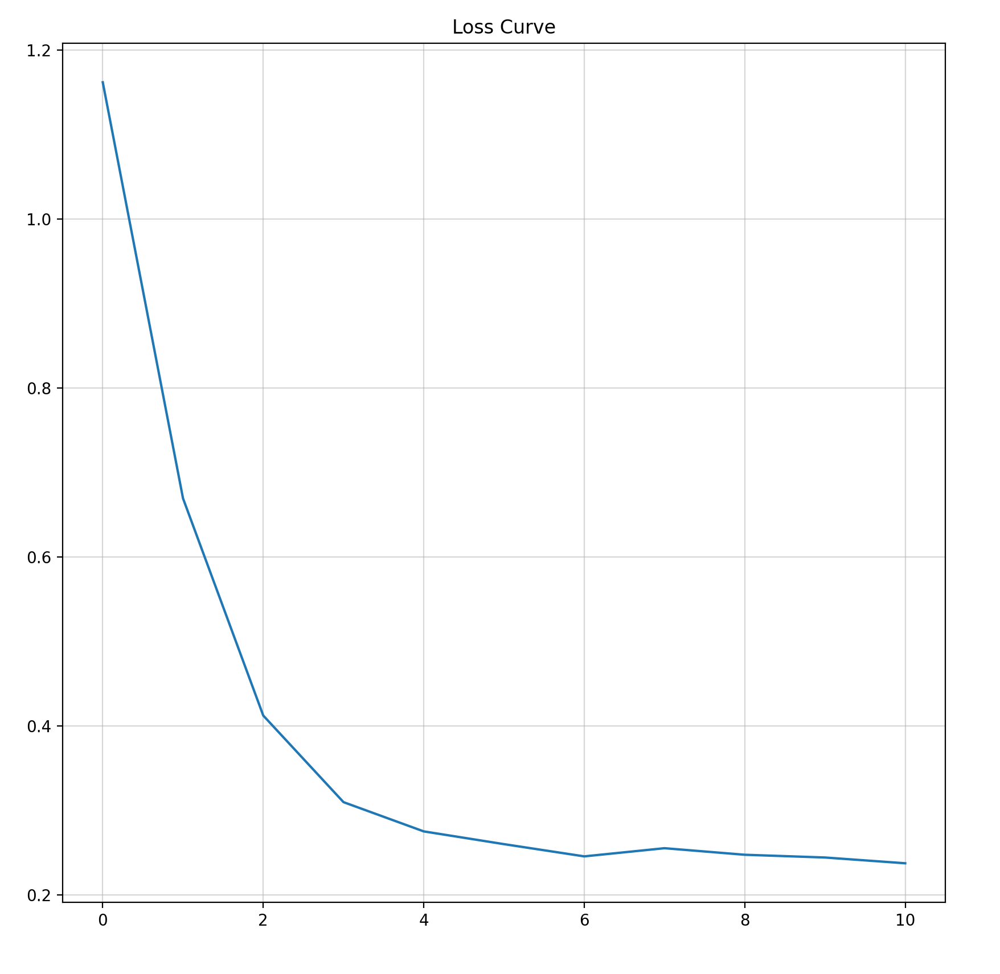
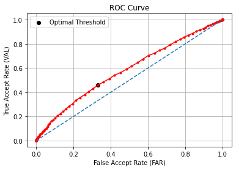

## Table of Content
* [FaceNet](#facenet)
* [W&B](#wb)
* [AT&T Faces](#att-faces--)
* [LFW](#lfw-)

# FaceNet

[FaceNet](https://arxiv.org/abs/1503.03832) is a face recognition system developed in 2015 by researchers at Google that achieved then state-of-the-art results. It maps the face images to euclidean space and learns on the L2 distance between the embeddings. Our paper notes on FaceNet can be found [here](https://hackmd.io/@ABD/SJa0J7_Od). 

This is a pytorch implementation of FaceNet paper with ResNet as the backbone architechture. At first the implementation was done on AT&T Dataset of Faces, then on LFW Dataset.
We used online triplet mining method for selecting triplets. 

# W&B
[Wandb](https://wandb.ai/) was used throughout this part of the <a href="https://wandb.ai/abd1/Face-Unlock" alt="wandb/Face-Unlock">project</a> for metric tracking, hyperparameter tuning, sweeps, visualization, etc. 

<p align="center">
    
    
    <br>
    <small><a href="https://wandb.ai/abd1/Face-Unlock/runs/c9fk2oj3">(a) Metrics of ResNet18 on LFW</a> <a href="https://wandb.ai/abd1/Face-Unlock/sweeps/vq62ojvw">(b) Sweeps of ResNet18 on ATT</a></small>
</P>


# AT&T Faces  [](https://colab.research.google.com/github/ABD-01/Face-Unlock/blob/master/facenet/FaceNet.ipynb)


The dataset was split in [35 training classes](media/train_data_ATT.png) and [5 test classes](media/test_data_ATT.png)

### Training

|          Parameter          |    Value   |
|:---------------------------:|:----------:|
|        Architechture        |  ResNet18  |
|     Embeddings Dimension    |     64     |
| No. of Learnable Parameters | 11,209,344 |
|            Epochs           |     200    |
|        Learning Rate        |   0.0002   |
|          Optimizer          |    Adam    |
|          Batch Size         |     100    |
|            Margin           |      1     |


### Results
|            Results           | Train Set | Test Set |
|:----------------------------:|:---------:|:--------:|
|           Accuracy           |    1.0    |   0.984  |
|            Recall            |    1.0    |   0.978  |
|           Precision          |    1.0    |   0.936  |
|     ROC area under curve     |    1.0    |   0.981  |
| Euclidean Distance Threshold |    0.91   |   0.89   |

### Plots

<p align="center">
    
    
    
     
    
    <br>
    <small>(a) Epoch Loss. (b) EER Curve. (c) t-SNE Emdeddings.<br>(d) ROC Curve on train set. (e) ROC Curve on test set</small>
</p>


# LFW [](https://colab.research.google.com/github/ABD-01/Face-Unlock/blob/master/facenet/FaceNet_LFW.ipynb)

[Deep Funneled](http://vis-www.cs.umass.edu/lfw/#deepfunnel-anchor) set of LFW images was used for training and evaluation purpose. 

The faces were extracted by center crop and then resized to match input shape. Further they were normalized overall data's mean and standard deviation.
```py
MEAN = torch.Tensor([0.5929, 0.4496, 0.3654])
STD = torch.Tensor([0.2287, 0.1959, 0.1876])
transform = transforms.Compose([
    transforms.CenterCrop((105,105)),
    transforms.Resize((224,224)),
    transforms.ToTensor(),
    transforms.Normalize(mean=MEAN, std=STD),
])
```
[LFWDataset.py](./../datasets/LFWDataset.py) contains the custom dataset classes for loading LFW data in both restricted and unrestricted configurations.
Eg,
```py
train_people = LFW_People(
    root = 'lfw_funneled',
    people_path = 'drive/MyDrive/lfw-dataset/peopleDevTrain.txt',
    transform = transform
)
test_pairs = LFW_Pairs(
    root = 'lfw_funneled',
    pairs_path = 'drive/MyDrive/lfw-dataset/pairsDevTest.txt',
    transform = transform
)
```

|                                 | Training   |                                                                 |
|---------------------------------|------------|-----------------------------------------------------------------|
|          Architechture          |  ResNet-18 |                            ResNet-44                            |
|     Embeddings<br> Dimension    |     128    |                               128                               |
| No. of Learnable <br>Parameters | 11,209,344 |                            21,535,936                           |
|              Epochs             |     100    |                                16                               |
|          Learning Rate          |   0.0004   | start=0.05<br>ReduceLROnPlateau(factor=0.5,<br> min_lr=0.00001) |
|            Batch Size           |     64     |                               100                               |

|  Results  | ResNet18 | ResNet44 |
|:---------:|:--------:|:--------:|
|  Accuracy |   0.814  |   0.564  |
|   Recall  |   0.750  |   0.459  |
|    FAR    |   0.127  |   0.332  |
| Precision |   0.856  |   0.58   |
| Threshold |   1.28   |   1.36   |

### Plots

<p align="center">
    
    
    
     
    <br>
    <small>(a) Epoch Loss. (b) EER Curve. (c) t-SNE Emdeddings.<br>(d) ROC Curve on train set. (e) ROC Curve on test set</small>
</p>
